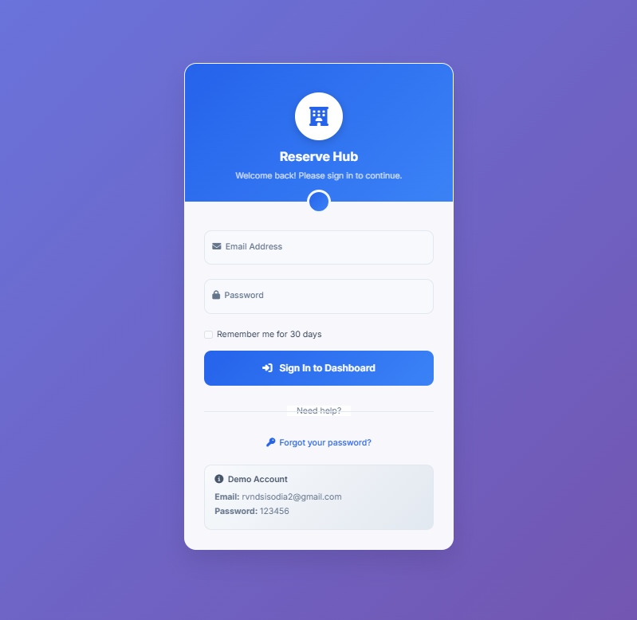
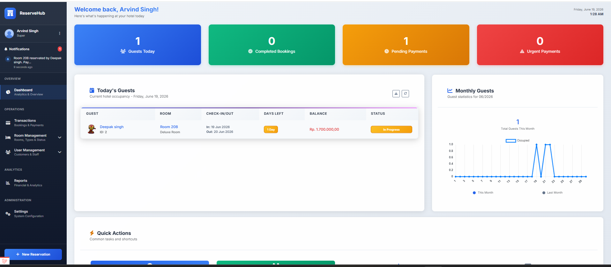
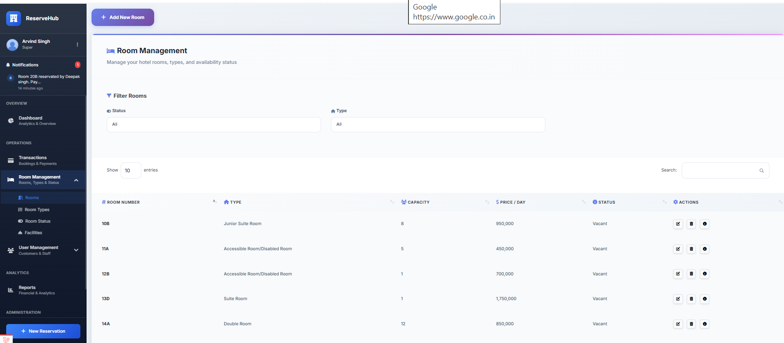
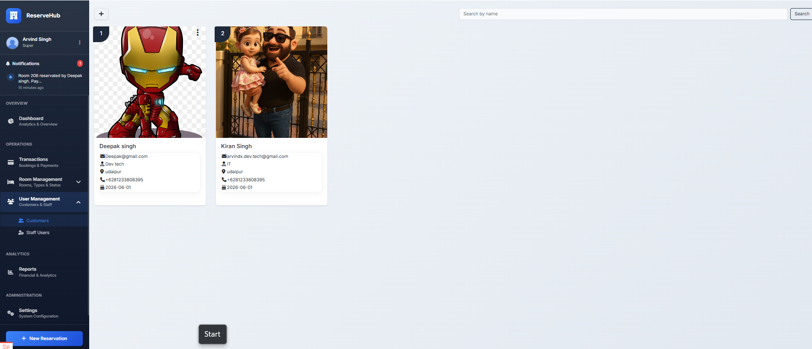
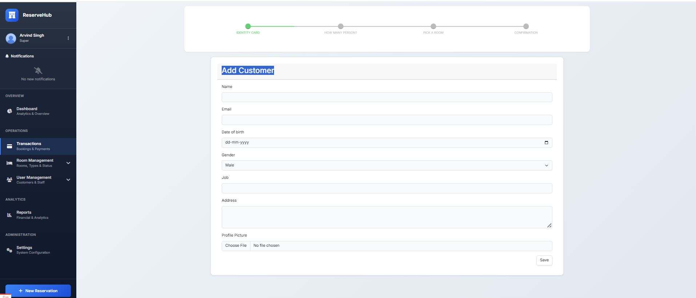
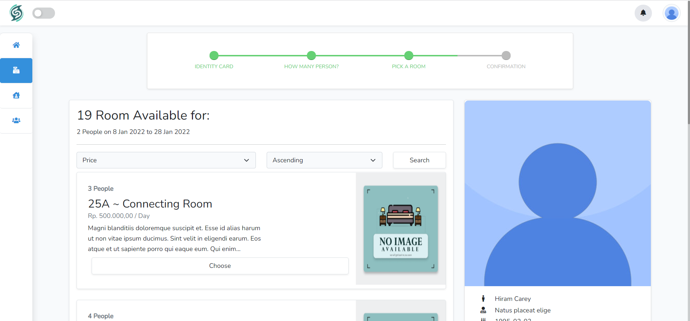
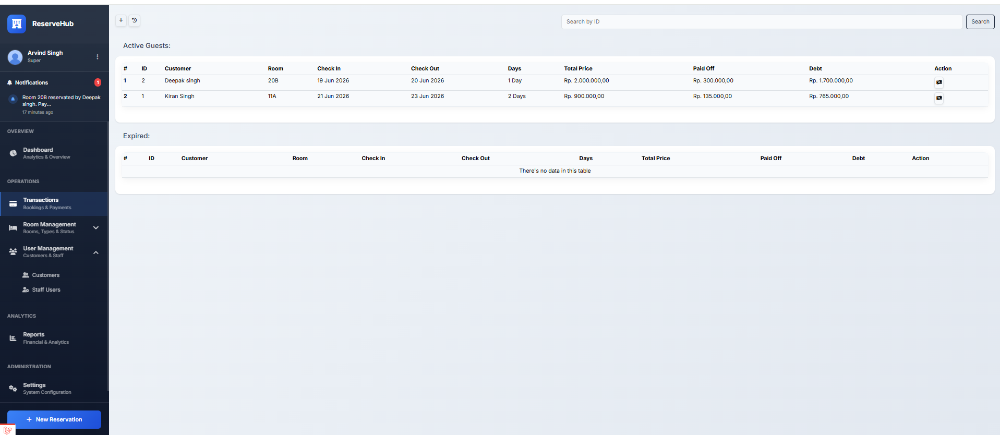
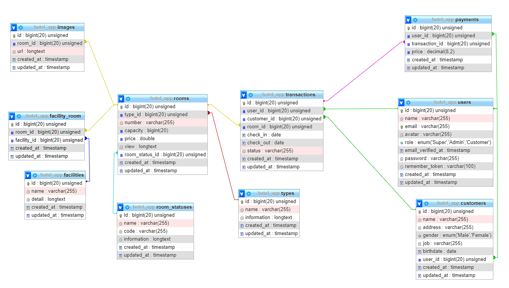

# ReserveHub - Hotel Reservation Management System

ReserveHub is a role-based Hotel Reservation Management System built with Laravel 12. The application helps hotel administrators manage customers, rooms, reservations, payments, and user activities through a centralized dashboard.

The project demonstrates practical implementation of Laravel best practices including Authentication, Role-Based Access Control (RBAC), Repository Pattern, Activity Logging, Real-Time Notifications, Database Seeders, and Factories.

---

## 📸 Screenshots

### Login



### Dashboard



### Room Management



### User Management



### Add User And Booking Rooms



### User Select Booking Rooms



### Transaction Management



### Invoice


### Database Table Relations



---

## ✨ Key Features

### 🔐 Authentication & Authorization

- Secure login system
- Role-Based Access Control (RBAC)
- Super Admin, Admin, and Customer roles
- Middleware protected routes

### 📊 Dashboard

- Reservation statistics
- Customer insights
- Room availability overview
- Activity monitoring
- Reservation analytics

### 👥 Customer Management

- Customer registration and management
- Customer booking history
- Search and filtering
- Customer profile management

### 🏨 Room Management

- Room CRUD operations
- Room categories and types
- Room status management
- Facility management
- Room image uploads

### 📅 Reservation Management

- Multi-step reservation workflow
- Customer selection and registration
- Room availability checking
- Reservation confirmation process
- Down payment tracking

### 💳 Payment Management

- Payment records
- Invoice generation
- Reservation payment tracking
- Payment history management

### 📜 Activity Logs

- User activity tracking
- Audit trail management
- Action history monitoring

### 🔔 Real-Time Notifications

- Laravel Reverb integration
- Reservation notifications
- User notification center
- Live updates

---

## 🏗️ Technical Stack

### Backend

- Laravel 12
- PHP 8.2+
- MySQL
- Eloquent ORM

### Frontend

- Blade Templates
- Bootstrap 5
- JavaScript
- Chart.js
- DataTables
- SweetAlert2

### Packages

- Laravel Reverb
- Spatie Activity Log
- Intervention Image

---

## 🗄️ Database Features

- Eloquent Relationships
- Database Migrations
- Database Seeders
- Model Factories
- Foreign Key Constraints
- Relational Database Design

---

## 🚀 Installation

### Clone Repository

```bash
git clone https://github.com/YOUR_USERNAME/reservehub.git

cd reservehub
```

### Install Dependencies

```bash
composer install

npm install
```

### Environment Setup

```bash
cp .env.example .env

php artisan key:generate
```

### Configure Database

Update your `.env` file:

```env
DB_CONNECTION=mysql
DB_HOST=127.0.0.1
DB_PORT=3306
DB_DATABASE=reservehub
DB_USERNAME=root
DB_PASSWORD=
```

### Run Migrations & Seeders

```bash
php artisan migrate:fresh --seed
```

### Build Assets

```bash
npm run build
```

### Start Application

```bash
php artisan serve
```

### Start Reverb Server

```bash
php artisan reverb:start
```

---

## 🔑 Demo Credentials

### Admin Login

**Email:** [rvndsisodia2@gmail.com](mailto:rvndsisodia2@gmail.com)

**Password:** 123456

---

## 📂 Project Structure

```text
app/
├── Http/Controllers
├── Models
├── Repositories
├── Notifications
├── Services

database/
├── migrations
├── seeders
├── factories

resources/
├── views
├── css
├── js

routes/
├── web.php
```

---

## 🎯 Learning Highlights

This project demonstrates:

- Authentication & Authorization
- Role-Based Access Control (RBAC)
- Repository Pattern
- Laravel Middleware
- Resource Controllers
- Eloquent ORM
- Database Relationships
- Database Seeders
- Model Factories
- File Upload Management
- Activity Logging
- Real-Time Notifications
- Dashboard Analytics
- Laravel Reverb Integration

---

## 🔮 Future Improvements

- REST API with Laravel Sanctum
- Online Booking Portal
- Booking Cancellation Module
- Email Templates
- Advanced Reporting
- Customer Reviews & Ratings
- Multi-Hotel Support

---

## 👨‍💻 Developer

**Arvind Singh**

PHP Developer | Laravel Developer

**Experience:** 10+ Years

---

### Repository Topics

```text
laravel
laravel12
php
mysql
hotel-management
reservation-system
rbac
bootstrap
reverb
activity-log
```

---

Built with Laravel 12 using modern web development practices.
